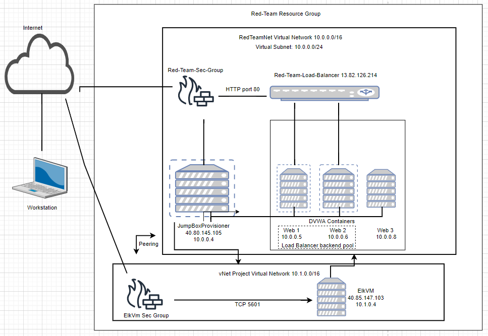

## Automated ELK Stack Deployment

The files in this repository were used to configure the network depicted below.

These files have been tested and used to generate a live ELK deployment on Azure. They can be used to either recreate the entire deployment pictured above. Alternatively, select portions of the YAML file may be used to install only certain pieces of it, such as Filebeat.

- [Ansible Playbook](https://github.com/jl667953/Elk-Stack-Project/blob/main/ansible/DVWA/my_playbook.yml)
- [Ansible Hosts](https://github.com/jl667953/Elk-Stack-Project/blob/main/ansible/DVWA/hosts)
- [Ansible Configuration](https://github.com/jl667953/Elk-Stack-Project/blob/main/ansible/DVWA/ansible.cfg)
- [Ansible ELK Installation and VM Configuration](https://github.com/jl667953/Elk-Stack-Project/blob/main/ansible/DVWA/install-elk.yml) 
- [Ansible Filebeat Playbook](https://github.com/jl667953/Elk-Stack-Project/blob/main/ansible/Filebeat/filebeat-playbook.yml)
- [Ansible Filebeat Config file](https://github.com/jl667953/Elk-Stack-Project/blob/main/ansible/Filebeat/filebeat-config.yml)
- [Ansible Metricbeat Playbook](https://github.com/jl667953/Elk-Stack-Project/blob/main/ansible/Metricbeat/metricbeat-playbook.yml)
- [Ansible Metricbeat Config file](https://github.com/jl667953/Elk-Stack-Project/blob/main/ansible/Metricbeat/metricbeat-config.yml)

This document contains the following details:
- Description of the Topology
- Access Policies
- ELK Configuration
  - Beats in Use
  - Machines Being Monitored
- How to Use the Ansible Build

### Description of the Topology

The main purpose of this network is to expose a load-balanced and monitored instance of DVWA, the Damn Vulnerable Web Application.

Load balancing ensures that the application will be highly _available_, in addition to restricting _access_ to the network.

- Load balancers add additional layers of security. They protect against DDoS attacks by distributing traffic before it gets to the webserver and by requiring a username and password to protect against unauthorized access.
- Adding a jump box to your network creates a funnels all admins to one point of access. This is another security feature. 

Integrating an ELK server allows users to easily monitor the vulnerable VMs for changes to the _data_ and system _logs_.
- _Filebeat monitors log files and locations. collects log events and forwards them to Elasticsearch using HTTP API or Logstash using TCP_.
- _TODO: What does Metricbeat record?_

The configuration details of each machine may be found below.

| Name                 | Function         | IP Address | Operating System |
|----------------------|------------------|------------|------------------|
| Jump Box Provisioner | Gateway          | 10.0.0.4   | Linux            |
| Web1                 | Web Server       | 10.0.0.5   | Linux            |
| Web2                 | Web Server       | 10.0.0.6   | Linux            |
| Web3                 | Redundant Server | 10.0.0.8   | Linux            |
| ELK                  | ELK Server       | 10.1.0.4   | Linux            |

### Access Policies

The machines on the internal network are not exposed to the public Internet. 

Only the _Jump Box__ machine can accept connections from the Internet. Access to this machine is only allowed from the following IP addresses:
- _My Personal Workstation Public IP_

Machines within the network can only be accessed by the _Jump Box_. 

- _Only the container located in the Jump Box Provisioner can access the ELk Server via SSH connection via the ELK Server private IP address: 10.1.0.4.  

A summary of the access policies in place can be found in the table below.

| Name     | Publicly Accessible | Allowable IP Addresses          |
|----------|---------------------|---------------------------------|
| Jump Box | No                  | Personal Workstation Public IP  |
| Web1     | No                  | JumpBox Private IP (10.0.0.4)   |
| Web2     | No                  | JumpBox Private IP (10.0.0.4)   |
| Web3     | No                  | JumpBox Private IP (10.0.0.4)   |
| ELK      | No                  | Personal Workstation Private IP |

### Elk Configuration

Ansible was used to automate configuration of the ELK machine. No configuration was performed manually, which is advantageous because _Ansible is able to deploy multiple apps without the need to write custome codes on each new server by using a playbook. 

The playbook implements the following tasks:

- Installs docker.io
- Installs pip3 (python3)
- Installs the Docker python module
- Increases virtual memory on the machine
- Downloads and launches Docker. Configures ports for elasticsearch, logstash and kibana. 

The following screenshot displays the result of running `docker ps` after successfully configuring the ELK instance.

### Target Machines & Beats
This ELK server is configured to monitor the following machines:
- _TODO: List the IP addresses of the machines you are monitoring_

We have installed the following Beats on these machines:
- _TODO: Specify which Beats you successfully installed_

These Beats allow us to collect the following information from each machine:
- _TODO: In 1-2 sentences, explain what kind of data each beat collects, and provide 1 example of what you expect to see. E.g., `Winlogbeat` collects Windows logs, which we use to track user logon events, etc._

### Using the Playbook
In order to use the playbook, you will need to have an Ansible control node already configured. Assuming you have such a control node provisioned: 

SSH into the control node and follow the steps below:
- Copy the _____ file to _____.
- Update the _____ file to include...
- Run the playbook, and navigate to ____ to check that the installation worked as expected.

_TODO: Answer the following questions to fill in the blanks:_
- _Which file is the playbook? Where do you copy it?_
- _Which file do you update to make Ansible run the playbook on a specific machine? How do I specify which machine to install the ELK server on versus which to install Filebeat on?_
- _Which URL do you navigate to in order to check that the ELK server is running?

_As a **Bonus**, provide the specific commands the user will need to run to download the playbook, update the files, etc.
